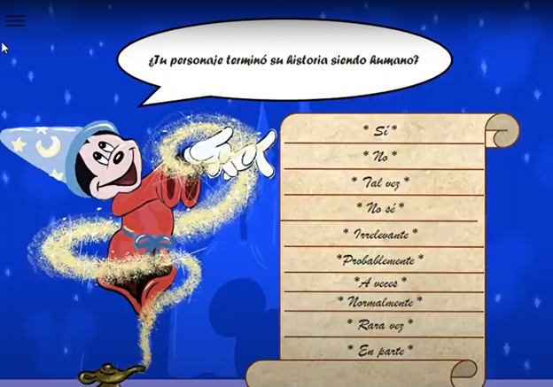
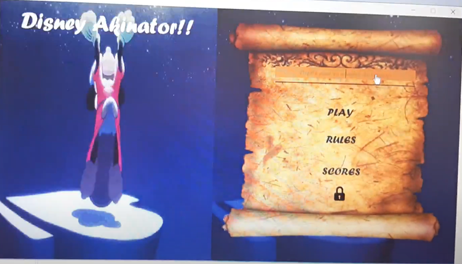

# 🏰 Disney Akinator  

Disney Akinator is a **Java desktop application** (built in NetBeans) that guesses which Disney character you are thinking of by asking a series of yes/no questions.  

The logic is powered by a **binary decision tree**, and the knowledge base (characters and questions) is persisted using **file-based storage**. With its graphical interface, the game becomes interactive and fun, simulating how an "Akinator" would think through questions until it makes a guess.  

---

## 📖 Project Overview
- 🎮 **Desktop application with GUI** (Java Swing, NetBeans)  
- 🌳 Uses a **binary decision tree** for yes/no decisions  
- 💾 **File storage** as database to remember and learn new characters  
- 🏰 Focused on **Disney characters** for a fun and familiar experience  

---

## 🛠️ Tech Stack
- **Language:** Java  
- **IDE:** NetBeans  
- **UI Framework:** Java Swing  
- **Data Structure:** Binary Tree (Decision Tree)  
- **Persistence:** File-based storage  

---

## 📸 How It Works

<a href="https://photos.app.goo.gl/6u6fgjyUhdmXhebM8" target="_blank">
  
</a>  

*(Click the image to see how it works)*  

The game builds a **decision tree** where each node is a question, and each branch represents "Yes" or "No". The leaves of the tree are Disney characters.  

Example:  

```text
                Is it a princess?
                   /       \
                Yes         No
               /              \
         Is she magical?       Is it an animal?
           /     \                /        \
        Yes       No         Yes            No
        Elsa    Mulan     Simba          Aladdin
```
---

## 🎥 Demo Videos

### Gameplay Demo 1  
<a href="https://photos.app.goo.gl/sykXyThTvhkCXe6M9" target="_blank">
  
</a>  

*(Click the image above to watch the demo)*  

---

## 👩‍💻 Learning Highlights
- Built a **decision tree engine** for dynamic yes/no question flow  
- Designed a **file-based persistence system** to add new characters/questions over time  
- Implemented a **graphical user interface** in Java Swing to improve user experience  
- Combined **data structures + GUI programming** in a fun, practical project

## 🛠️ Installation & Setup

To run Disney Akinator on your computer:

1. Download or Clone the Repository

```bash
git clone https://github.com/karou1182001/disneyAkinator.git
cd DisneyAkinator
```

2. Open in NetBeans

- Open NetBeans IDE
- Go to File > Open Project
- Select the DisneyAkinator folder

3. Run the Project

- Make sure you have Java JDK 8 or later installed

- Click the green Run ▶ button in NetBeans

The GUI will launch and you can start playing!
